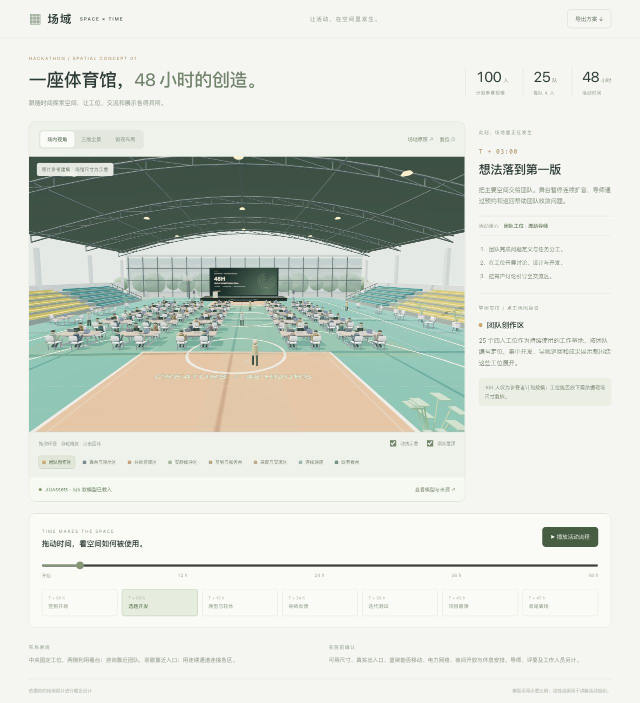

# Scendance · 场域

100 人、48 小时黑客松空间方案

基于用户提供的体育馆参考照片制作的空间与时间交互原型。计划参赛规模为 100 人，25 支四人团队；导师、工作人员和评委另计。

## 运行

在本目录执行 `python3 -m http.server 8766 --bind 127.0.0.1`，打开 http://127.0.0.1:8766/ 。

使用本地保存的 Three.js 0.186.1、GLTFLoader 与 5 款 GLB 素材，不需要安装 npm 包、登录或配置 API Key，打开场景时不向素材供应商请求文件。浏览器需支持 WebGL 2 和 import maps。由于使用 ES Modules 和本地模型请求，必须通过 HTTP 服务打开，不支持双击 `index.html`。

## 交互

- 在场内视角、三维全景、俯视布局之间切换。拖动环视，滚轮或双指缩放。
- 点击区域或图例查看用途与现场确认事项。
- 拖动 48 小时时间轴，查看签到开场、开发、轮休、导师反馈、迭代、路演和收尾。
- 播放/暂停活动流程，切换动线及钢架屋顶。
- 查看原照片、下载完整 Markdown 方案。
- 查看 3DAssets 模型加载状态；打开“查看模型与来源”可跳转原始资产页面或下载对应的真实 GLB 文件。
- 点击“旋转查看模型”或打开 `models.html`，逐个放大查看真实素材；模型预览支持拖动旋转与滚轮缩放。

## 已接入的素材

会议桌、活动座椅、笔记本电脑、宽叶盆栽和舞台音箱。五款源模型共 262,516 字节，来自 3DAssets.dev 官方 API，按用途缓存到 `assets/models/`。素材清单在 `assets/catalogue.json`，完整来源、授权、文件哈希与检查记录在 `ASSET-SOURCES.md`。重复工位复用模型几何。

Three.js 官方 npm 包的 SHA-512 完整性已验证，版本固定为 0.186.1，仅保存运行需要的文件到 `vendor/three/`，MIT 授权随文件保留。`renderer-webgl.js` 是当前渲染器。

## 模型边界

Three.js 对真实三维网格进行渲染，道具使用 GLTFLoader 加载 GLB；体育馆、看台、舞台、人物和动线由程序搭建。照片仅作为形态参考，未进行测绘或自动三维重建。场馆采用示意比例，不代表实测尺寸、核定容量或人流仿真。入口、舞台、篮架处理、电力、网络、夜间开放、休息安排均需要现场确认。时间轴上的阶段变化和人物动线用于讲解活动流程，日夜变化以假定上午 9 时开场展示。

## 场景预览

## 项目入口

- `index.html`：体育馆三维场景与时间轴。
- `models.html`：五款模型的独立旋转预览与下载。
- `ASSET-SOURCES.md`：素材来源及授权记录。
- `VALIDATION.md`：已完成的检查。

## 后端开发

本仓库新增 Supabase 后端文件，详见 [后端开发入口](BACKEND.md)。包含权限、项目保存、编辑租约、AI 提案、三维生成任务、资产归档和客户分享；尚未与现有前端联调。接口、部署步骤和验证边界见后端文档。
