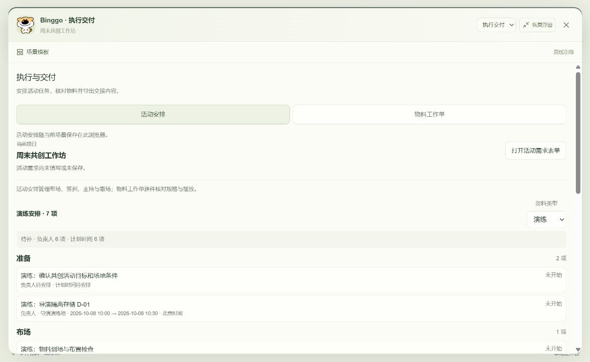
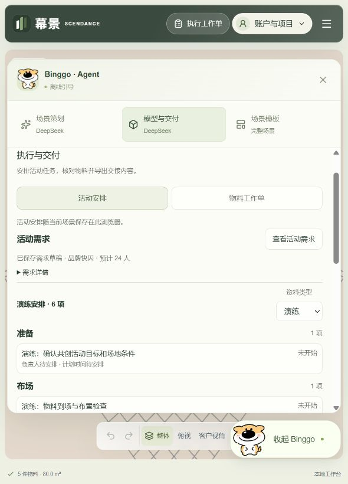

# 幕景开发检查点 · 2026-10-07

分支：`codex/delivery-research-20261007`。基于 `d139da72694cca53809eba444ee1c5b909cdb627`。

这一版把原场地编辑器向活动执行推进：可以在本机安排任务、分工、记录检查结果、处理场景变更，并导出交接材料。**当前定位是可演练的本地开发版，真实活动、云端执行协作和线上模型效果尚未完成验收。** 线上站点独立部署，不代表本分支状态。

后续完整授权范围与阶段验收见 [产品升级计划](plans/product-evolution.md)：创意简报与客户评审、制作来源及费用收付款、业务变更与复盘、条件成熟后的云协作。人工简报模板逻辑已验证，可见入口与完整恢复仍在接入。

## 后续增量：按工作目标重构导航

首个已上传检查点为 `d215af9`。随后针对“点击椅子跳回场景策划”的实际问题，重构了同一项目内的工作区：

- 右上角切换 **场景策划 / 物料建模 / 执行交付**，执行工作单不再藏在建模子页里。模板改为独立资源入口，可返回原工作区。
- 选椅子后留在建模，策划和建模分别保留输入；建模请求只针对指定物料，强制预览后确认，沿用原项目与任务协调机制。
- 工作区可以展开、恢复浮窗、关闭重开；候选提供回到画布预览入口。客户需求前移，图纸及助手设置按需展开，执行页先呈现项目、负责人、计划时间和待补项。
- 模板下载期间返回工作区会取消迟到应用。确认替换模板或空白场地时保留活动身份与任务，旧物料关联明确提示缺失，不自动关联到新物件。
- Agent物料汇总按场景颜色区分同尺寸物料；同色同规格仍合并。场景颜色不能当作供应商实物颜色或报价依据。
- 补齐外部模型引用变更的复核：无稳定归档编号的模型，完整来源地址或版本参数改变会使关联活动任务进入需复核，实际记录及证据保留。有稳定编号的临时地址刷新仍不误报。同一地址背后的文件静默变化无法据此检测。

本轮前端10套定向测试178项、类型及相关代码检查通过；后端Agent相关56项、类型及Edge检查通过。生产构建与11页静态生成通过，保留原有非阻断警告。独立浏览器来源验证了椅子留在建模、两份草稿保留、模板返回、收起重开、展开按钮可点，原有7项演练任务及唯一标记保留；390px无页面横向溢出。模拟请求验证了预览与显式确认，未发起真实收费请求。

成熟案例、取舍及状态流程见 [工作区方案](plans/workspace-modes.md)。本轮未接入完整备份恢复界面，未改变执行云协作的边界。

外部模型引用修复另经4套71项相关回归验证；两项新增用例先复现错误的已完成状态，修复后正确进入需复核，导出状态同步且撤销引用后恢复原核对结果。测试覆盖范围与上表重叠，不累加为全量测试数。

随后补齐活动任务的地板核对范围：铺装类型与颜色变化会进入需复核，兼容普通场地和测量重建场地，并在保存回读及CSV导出后保持这一结果。四项新反例先失败后通过，连同默认纯色等价检查及原保存/界面回归共3套61项通过。旧版本核对依据未覆盖这些条件，因此既有已完成或已核对任务可能需重新确认一次；原证据和实际时间保留。这是合法布局数据与恢复链路的验证，不宣称新增了铺装编辑按钮或完成现场检查。

场景编号校验现会拒绝同一UUID的大小写重复写法，覆盖物件、结构实体、来源、尺寸和出入口，并阻止出入口与普通物件编号碰撞；正常大写编号与引用保留原样，兼容旧入口向门洞的转换。后端35套476项、前端场景转换与结构34项、根类型和Edge检查通过，导演补查前端整体类型检查通过。验证使用隔离数据库与实际转换函数，没有生产数据迁移；此结论不代表SQL直连或所有旧异常记录已被自动修复。



## 已经做了什么

| 模块 | 当前能做的事 |
|---|---|
| 直接入口 | 顶部「执行工作单」一次点击进入；支持键盘焦点返回，590px及390px入口已检查 |
| 活动安排 | 按准备、布场、活动、撤场组织任务；签到、主持等任务可以不关联三维物料；记录负责人、承接团队、条件和证据 |
| 时间与列表 | 计划开始/结束与实际时间分开；空值保留未知，倒序时间拒绝；折叠行可直接查看负责人和北京时间排期 |
| 物料工作单 | 每个实例独立记录负责人、期限、验收条件与结果；同规格物料采购合并，执行记录保持逐件关联 |
| 变更复核 | 计划、条件、责任、尺寸、摆放及已覆盖的场景结构/造型变化触发需复核；原说明保留；删除关联物料会明确断链，撤销可恢复 |
| 本机保存 | 场景与执行记录进入原保存、撤销、恢复路径；需求沿用原表单来源，读取/保存失败明确提示，不以默认值覆盖原资料 |
| 交接导出 | 场景JSON、物料CSV、逐件执行CSV与活动安排CSV使用快照编号；活动记录保留计划/实际、有效状态、缺失物件和演练标识 |
| 分享保护 | 普通公开场景分享移除执行资料；归档模型的临时加载地址从相关导出副本清理；不修改原画布 |
| Agent可靠性 | 模型回复先整体校验工具ID；同次运行重复ID/等价参数重放原回执，冲突拒绝；checkpoint确认后才提升候选，避免失败后误报完成 |
| 备份文件模块 | 已实现包含可编辑场景、原活动需求、两类工作单及核对依据的文件格式和校验；**可见的备份/恢复按钮仍待接入** |

演练入口只载入任务模板，不会把原活动需求的人数或文字自动改为模板背景。请在原活动需求中填写实际信息。已确认完成是本机记录，不是服务端审计或客户签字。

## 验证证据

| 验证 | 结果与范围 |
|---|---|
| 根类型检查与后端全量 | 通过；34个测试文件、460项测试通过 |
| 前端相关回归 | 22套、559项通过，覆盖任务/物料、保存恢复、断链、分享、时间、云保护和需求草稿 |
| 备份文件模块 | 29项定向测试通过；前端完整类型检查通过 |
| 生产构建 | `npm run build` 通过，完成静态导出；仍有非阻断导入排序和既有静态导出rewrite提示 |
| 浏览器演练 | 原需求回读、六项四阶段任务、无物料任务、倒序拒绝、完成后改计划需复核、实际时间/说明保留、刷新重开、删除关联/撤销均已操作 |
| 实际下载 | 活动CSV与场景JSON快照编号一致；计划与实际时间分开；断链CSV保留任务、原ID和缺失标记 |
| 独立来源复开 | 独立演练来源的新页面读回七项任务和唯一标记、负责人、排期；尺寸切换后复开也通过 |

这些范围有交叉，不相加成一个总测试数。隔离内存/假供应商测试不能代替真实云端与真实活动验证。检查脚本见 [本地执行与恢复核查](plans/local-delivery-loop-audit.md)。

## 怎么看这一版

使用支持项目引擎要求的Node版本；本次以Node 26.2.0验证。在仓库根运行：

```sh
npm ci
npm --prefix frontend ci
npm --prefix frontend run dev -- --hostname 127.0.0.1 --port 3157
```

打开 `http://127.0.0.1:3157/?local=1`。这个地址只适用于运行服务的电脑。

建议用独立演练走一遍：

1. 打开「执行工作单」，查看「活动安排」与「物料工作单」两个页签。
2. 明确填写活动需求，或选择演练任务模板。
3. 为一项任务填写负责人、计划时间和完成条件；没有物料也能保存。
4. 仅在演练中填写明确标注的模拟记录，确认完成后修改计划，检查需复核提示。
5. 为布场任务关联一件物料，删除后检查断链，再撤销。
6. 等「已保存到本机」后刷新，并下载CSV核对结果。



## 还没有完成

- 备份文件模块尚未接到主界面的可见导出/恢复操作。当前「导出场景JSON」是交付封套，不能当作完整编辑备份；备份模块也不打包独立图片附件、模型文件、重建表单或聊天。
- 已支持一键展开/恢复工作区；任意拖动尺寸暂后置。
- 云端活动安排、跨设备回填、外包协作权限、真实模型调用与真实现场验收尚未完成。
- 真实活动预算、报价、收付款、人员资源管理和完整复盘仍需后续增量；上游演示价格及AI请求记账不能当作活动财务。
- 尚没有完整的任意活动复制与实例重映射界面，也没有业务层面的客户验证结果。

## 开源参考如何落地

已核对 AIHOT 与官方 DeepSeek Harness 的固定源码，具体位置、许可、采用机制和测试见 [Agent开源参考](plans/agent-reference-study.md)。本轮增强的是幕景现有Agent的回复校验、工具回执与失败恢复；独立Harness Runtime、可配置部署和新活动任务提案仍是后续工作。

共享定义见 [物料工单契约](plans/delivery-contract.md)、[活动安排契约](plans/event-operations-contract.md)；备份文件接口见 [场景与活动备份](plans/local-project-backup.md)。
