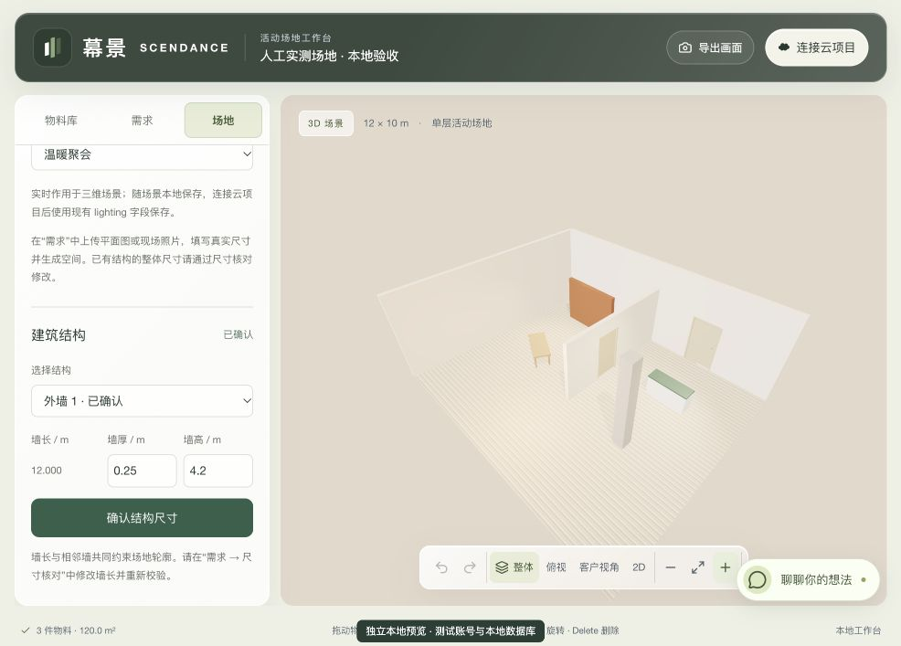

# 图纸与照片重建验收记录

验收日期：2026-10-03。分支：`codex/floorplan-to-3d`。基线：`origin/main` 的 `edc5341`。

## 已完成的本地验证

| 验证 | 结果 |
| --- | --- |
| 后端完整测试 | 13 个文件、142 项通过 |
| 前端完整测试 | 113 个文件、1,488 项通过；最终修复补跑结构 39 项及界面 31 项，均通过 |
| 后端 TypeScript | 通过 |
| 前端 TypeScript | 通过 |
| Edge 函数检查 | scene-api、generation-worker、reconstruction-worker 三个入口通过 |
| 前端生产构建 | 最终修复后通过，8 个静态页面生成成功；代码 lint 无报错或警告 |
| 独立数据库与图片重启恢复 | PGlite 与私有来源文件跨进程恢复测试通过 |
| 原项目隔离 | 原项目受跟踪文件无差异，原分支与 HEAD 未改变 |

运行环境为 Node 24.19.0。完整测试使用 `--maxWorkers=2 --testTimeout=15000`。HTTP 联调需要 loopback 监听权限；沙箱内的 EPERM 在获准监听后消除。JSDOM 的 canvas/navigation 提示不代表真实 WebGL 渲染验收，画面另通过浏览器检查。

Next 的静态导出仍提示 `rewrites` 不会用于纯静态输出；实际部署需沿用仓库既有静态路由配置。本次只交付本地预览，没有部署。

覆盖场景包括墙、斜墙、凹多边形边界、柱子、旋转和缩放物料、开口、挂墙规则、历史冲突逐步消除、批量操作原子性、v1/v2 往返、确认尺寸偏差、来源权限、分享脱敏、重建队列领取、预算预留、重复请求、候选过期、锁定物件保留、提案应用及撤销。

前端 HTTP 联调调用真实应用 API 和 SQL；认证、对象存储及模型响应使用明确的测试替身。测试结果不能作为真实模型识别质量或 Supabase 云环境验收。

## 浏览器操作记录

独立预览位于 `http://127.0.0.1:3026`，API 位于 `http://127.0.0.1:54336`。人工样例为 12 × 10 × 4.2 米，含内外墙、两个门洞、一个柱子和三件活动物料。

- 登录本地测试账号，创建独立项目并打开人工实测样例，获得编辑权。
- 在二维与三维之间切换，检查相同结构、门洞、柱子、旋转桌子和 120 平方米面积显示。
- 将外墙厚度从 0.20 米改为 0.25 米；撤销恢复为 0.20 米，重做恢复为 0.25 米。
- 上传人工图纸 `tests/fixtures/floorplan-measured.png` 和仓库现场照片 `assets/venue.jpg`，分别识别建议为平面图和现场照片，可手动纠正类型。
- 输入整体尺寸、活动需求和风格；照片模式须明确选择。已确认结构遇到新增来源时，生成请求要求显式开启重新识别。
- 私有图片上传后，未配置真实模型的生成请求明确失败，原场景和资料保留，没有伪造候选。
- 将结构修改保存至独立数据库版本 1。刷新重新进入工作台后，墙体、两张图片、尺寸、需求与风格恢复；照片模式按每次生成重新选择。

人工场地和标注图纸用于验证数据与交互，均不是模型识别结果。

## 最终审查修复

- 结构属性修改保留家具的资产 URL、名称和分组等展示信息。
- 创建项目之前等待图片处理和表单保存，避免刚输入的要求或刚上传的图片在切换项目时丢失。
- 两点图纸标定支持有足够非共线证据的任意参考段；退化、矛盾或无法关联的标定保持待核对。照片不采用全图统一比例尺。
- 门洞非零离地高度在转换、渲染和保存之间保留，避免静默归零。
- 未配置服务、预算及任务状态错误使用用户可理解的提示；有图纸、照片或 v2 结构时隐藏旧生成入口。

## 尚未完成的外部验收

以下项目需要真实服务配置或标注评测资料，当前不标记完成：

1. DeepSeek 实际图像识别、思考规划、费用统计及超时表现；Qwen 同图对照评测。
2. 使用人工标注的专业图纸、手绘图、单图和多视角照片，测量实际识别误差、遮挡处理和跨照片对应关系。
3. 独立 Supabase 测试环境的 Auth、Storage、迁移、定时 worker、分享和多人并发。
4. 混元 LowPoly 真实资产生成、加载与尺寸校验；当前继续使用已有按需单体流程。

当前局部尺寸约束不能唯一确定结构时会要求核对；通道净宽、疏散路径等尚未进行专门的几何验算，会保留未完全满足的说明。1 毫米阈值只衡量确认尺寸在计算和保存中的一致性，不代表图片识别精度。

项目没有合并至原分支，也没有部署或写入原站数据库。
