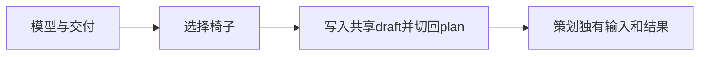
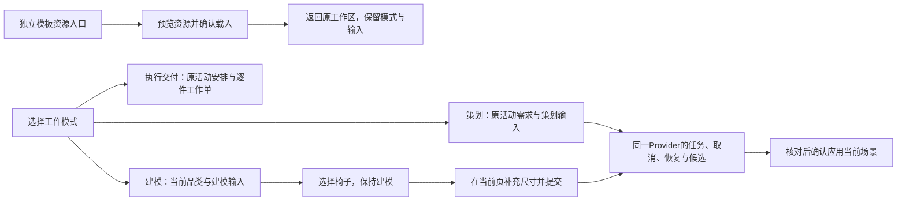

# Binggo 工作区：目标、模式与执行路径

2026-10-07。用户直接要求按成熟案例确定目标并执行，保证好用，最重要内容先呈现；同时提出可放大缩小，并反馈选择椅子后无说明跳回场景策划。重构前检查点d215af9已由导演提交并上传，冻结解除。本轮直接实施此统一方案，前端保留共享分支、暂存区及3157预览；不混入完整备份恢复UI。

## 本轮可验收目标

用户打开工作区就知道正在做什么、当前项目是什么、下一步怎样操作。建模从选择椅子、填写尺寸，到查看候选和确认应用，持续停留在建模目标下；排期能直接看到工作、负责人、时间与缺项。工作区可展开／恢复，切换模式或尺寸不会清除当前输入、选中物件、表单、任务或滚动位置。

三个判断先于布局：当前目标是否清楚；下一步动作是否可达；完成与失败是否有可核对的结果。型号服务、资料上传和高级生成策略按其操作需要放置，不抢占需求或任务的首屏。

## 已验证的卡点

- 在独立 `localhost.` 演练来源，进入模型与交付→物料建模→点击椅子，活动标签确实变为场景策划；预填需求出现在策划输入框。没有提交生成请求或改用户127.0.0.1资料。
- 根因位于 `CreativeAssistant` 的品类按钮：同时 `setDraft(prompt)` 和 `setTab('plan')`。仅删除跳转会留下不可见输入，因为对话、任务进度、候选与确认目前只有plan面板渲染。
- 该演练窗口中的浮窗实际为440×500px，可滚内容只有188px。需求前面还有模式设置与图纸说明；底部输入与页脚是普通布局区域，主要问题是可用空间被挤小。
- 截图的24人需求与30人演练入口没有解释关系。演练模板只创建六条新任务，保持原需求／场景，现有逻辑正确但表达不足。
- 场景模板当前已有预览图片、异步载入、替换确认和过期画布检查；它是完整场景资源。换资源与选AI服务必须保持清楚的意义。

## 成熟官方依据及采用边界

| 来源 | 实读行为 | 幕景采用 |
|---|---|---|
| [Blender工作区](https://docs.blender.org/manual/en/latest/interface/window_system/workspaces.html) | 工作区按建模、材质等任务组织布局，任务与编辑Mode分别定义 | 模式明确表示当前工作，保留项目与已填内容；右上角位置是幕景的设计选择 |
| [Blender资源浏览器](https://docs.blender.org/manual/en/latest/editors/asset_browser.html#using-assets) | 对象／材质资源有指定用途与导入行为 | 建模品类有明确目标，模板按资源预览及确认载入，服务名称放到设置／状态 |
| [ChatGPT桌面官方说明](https://learn.chatgpt.com/docs/app) | 模式切换明确选择Chat／Work，内容与可检查的输出在同一工作环境里 | 借鉴持续可见的模式与工作上下文；不声称官方规定模式按钮必须在右上角 |
| [OpenAI扩展查看器](https://learn.chatgpt.com/docs/image-generation) | 同一会话的图像可以在聚焦／Canvas视图中查看 | 尺寸与视图切换保留同一内容；不重新创建表单或任务 |
| [Rentman项目排期](https://support.rentman.io/hc/en-us/articles/360013599680-Time-Schedule-of-your-Project)／[Cvent执行安排](https://www.cvent.com/en/blog/events/event-itinerary) | 执行涉及进撤场、工作人员、时间和必要物料 | 活动任务主信息为动作、负责人、计划区间和完成条件；物料工单用于逐件检查 |

这些依据支持工作区与流程原则，不证明幕景已经实现或完成现场验收。不安装整个案例产品或建立新Agent协议。

## 信息层级与入口映射

按三个工作目标组织：场景策划、物料建模、执行交付。右上角用持续显示当前值的模式选择替代占高的大标签。模板独立作为资源入口，打开资源视图后可返回原工作区，原模式和输入不变。尺寸按钮独立控制展开／恢复；主工作台「执行工作单」仍一键直达执行交付。执行不再嵌套在建模工具中。

| 入口／模式 | 主内容 | 主要动作 |
|---|---|---|
| 场景策划 | 当前活动、目标／客户需求、类型／人数、必需项 | 填写需求→请求方案→核对候选→确认应用 |
| 物料建模 | 当前品类与物料需求、尺寸／样式输入、当前任务和候选 | 选择椅子→在本页继续填写→提交→预览／确认，不跳策划 |
| 物料建模·材质调整工具 | 指定资产／物件、调整范围、材质候选 | 沿用原材质调整与应用保护，切执行不改此工具或草稿 |
| 执行交付 | 当前项目与需求摘要、活动安排／物料工作单、负责人／计划／需复核 | 填任务→保存→核对→导出 |
| 独立场景模板资源入口 | 已有完整方案预览及来源／概念说明、返回原工作区 | 预览资源→明确确认替换→继续编辑；打开资源或切模式本身不应用模板 |

辅助层使用原生折叠：助手设置显示当前行为的简短摘要；图纸／照片／现场条件和重建的静态输入按需展开。正在运行的任务、错误、保存失败及待确认候选持续可见。DeepSeek不再重复充当能力标题。

```text
标题：Binggo · 当前项目             工作模式 ▾  展开/恢复  收起
主区：当前目标 + 下一步动作
      需求/物料工具/执行任务/模板资源
      运行结果、错误、候选与确认
输入：当前模式的输入（策划或建模）及提交动作
```

沿用当前风格：背景#fcfcf7、正文#33453b、操作绿#48643e、边界#dfe5d6、次要文字#74806b。系统字体保持，标题／正文／时间数据以字重和层级区别；通过可用空间与排列提高可读性，不额外添加装饰、供应商大标签或重复看板。

## 当前与目标状态流





## 状态与数据的最小改动

- `CreativeStudioProvider`仍是唯一Brief、images、messages、run、preview与候选协调者。`generate(message)`、取消、恢复、expected revision与云边界全部沿用；不加后端mode字段。
- 策划与建模使用同一个持续挂载的输入／结果区，在Assistant里分别保留两份界面草稿。当前模式切换不发请求、清草稿或改场景；品类按钮只预填建模草稿并聚焦该输入。
- 当前项目scope变化清理两份草稿和旧物料seed；已有自动工作台准备期间的输入保留逻辑继续生效。A→B切项目不能串输入，A模式→B模式→A保留各自输入。
- 任务、候选与确认不复制成两套控件。全局busy／recoverable仍锁住重复提交；模式切换不取消真实任务，当前进度与取消／恢复入口可见。
- 独立尺寸状态只切同一section的class；不进入焦点或自动滚底effect依赖。优先一键展开／恢复和稳定的响应布局，原生浮窗调宽在不干扰布局时再采用；窄屏展开充分使用视口。关闭、输入、错误和确认按钮均不能超出窗口。
- 当前模板组件的预览图片、异步载入、确认与画布过期检查继续复用。完整模板的交付门禁保持，不把资源预览解释为已生成或已验收。
- 活动任务页首要内容是项目、真实保存的需求摘要、任务的负责人和时间。空状态先提供新增，再给明确标注的30人共创六任务示例；待补与复核概览从原数据派生。

## 验收清单

| 编号 | 必须证明 |
|---|---|
| W1 定位 | 模式选择持续显示当前工作；选椅子后仍在建模，可继续填写；不发生付费请求 |
| W2 输入 | 策划／建模往返、展开／恢复，需求、两份草稿、当前工具、物件选择及表单DOM保持；模式/尺寸操作不突然滚底或搬焦点 |
| W3 结果 | 在建模模式提交的mock候选能预览、确认；进行中切模式仍能取消／查询原任务；不会重复发请求或出现两套确认 |
| W4 需求 | 打开需求时主目标／人数先于上传说明；助手设置及静态配套输入默认收起，任务状态、保存/运行错误和确认始终可达 |
| W5 执行 | 当前活动/需求与任务关系清楚，逐件工作单用途明确；演练不改当前需求和场景；负责人/时间/需复核及失败诚实呈现 |
| W6 尺寸 | 桌面和590/390px展开、恢复、关闭、输入及内容滚动可操作，document无横向溢出；若采用原生浮窗resize须有视口限制 |
| W7 保存 | 独立演练填写并保存需求和任务，尺寸／模式切换后回读相同；坏输入和失败保留草稿。新工作区不宣称已有完整文件恢复界面 |
| W8 边界 | 无新增依赖、schema、迁移或服务；保留既有本地、Agent/cloud防覆盖、模板门禁和历史测试。真实云/付费生成/现场事实另行验收 |

实现后运行相称的相关测试、typecheck、文案与diff检查，在独立来源做真实界面操作与截图。导演协调production build，不并发build/dev，不自行stage／commit／push。当前已开始实施，功能完成以实际检查与界面回读为准。

## 2026-10-07 · 实施冻结与可构建回执

源码已冻结，可由导演构建。三个目标工作区、独立模板资源入口、展开／恢复、两份模式草稿及主要需求／执行信息已落地。建模使用本地意图参数，命令不拼整场策划指令，强制existing `executionMode: preview`且禁止direct consumption；原策划DirectApply设置保留，建模中明确显示不适用。候选可恢复浮窗回到画布，原候选保持。

模板资源仅在打开时挂载，返回工作区后迟到下载不会应用；真实Assistant导航回归覆盖该路径，不仅测试模板组件卸载。实际应用完整模板及空白形状时，模板专用入口保留当前活动ID／需求scope及全部eventOperations；旧objectIds不猜测重挂，新几何导致缺失／复核。旧实例工单不复制给新实例，沿原整布局撤销生命周期恢复；恢复点写入仍依赖本机存储，不宣称跨刷新恢复保证。

最终10个互不重复的定向套件178项通过，包含真实Provider的局部建模命令／强制预览／显式确认、模式草稿／项目切换、资源迟到、尺寸与滚动、原需求及照片生命周期、重建状态、任务与模板数据保留、原交付与云保护。typecheck与11个相关文件lint通过；文案检查2332条clean；diff检查通过。页面往返套件此前缺少IndexedDB环境，在完整需求保存保护后无法提交mock任务，已显式补本地资料Map测试环境，保留实际Provider和flush协调器，不吞产品读取错误、不增加依赖。没有真实模型或付费请求。

独立localhost.浏览器实际确认：原六任务保存后仍在；当前项目及任务待补优先显示；策划填写30人演练说明，椅子按钮仍在model并预填需求；改为0.55米演练草稿后往返执行与策划，两种草稿互不覆盖；打开模板资源再返回、恢复浮窗、收起再打开均保留建模草稿。展开在1280×720视口范围为(16,16)到(1264,704)，内容区578px；模式／恢复／收起中心点hit-test均指向自身，没有文档横向溢出。截图为 [展开执行工作区](../../frontend/docs/evidence/workspace-execution-desktop.jpg)。

调试期间出现一次动态组件CSS缺失的HMR中间态：DOM新而样式只有app/layout，computed block／透明背景。源码稳定后普通刷新，动态room-organizer样式表326条规则加载，样式及hit-test恢复。没有清缓存、停启服务或为中间态修改样式系统；该诊断已补Windows本地产物skill并校验通过。

导演最终独立浏览器回执已通过：完整刷新director.localhost后，七任务／D-01保留，椅子留建模，模板进入／返回保留model草稿，X收起再开保留模式／草稿，展开恢复按钮hit-test命中；390×844无横溢，展开／恢复和输入正常。原热更新期间重开无响应在完整刷新后不复现，没有作为新产品缺陷补代码。证据为 [390px建模](../../frontend/docs/evidence/workspace-model-390.jpg) 与 [展开执行交付](../../frontend/docs/evidence/workspace-delivery-expanded.jpg)。导演和前端viewport均已reset；production build及构建后回读由导演执行。QA tab1保留交接，未操作用户127.0.0.1页面。原生拖动尺寸按本轮授权后置，完整备份恢复界面继续独立下一轮，不冒称已完成真实云协作或现场验收。

## 导演最终验收

生产构建通过，11页静态生成完成；保留原有非阻断警告。恢复3157服务后，独立演练来源回读7项任务及D-01标记。桌面与390px完成椅子留建模、模式草稿、模板返回、收起重开及展开/恢复操作；390px与590px均无文档横向溢出，展开顶部按钮命中自身。临时视口已恢复。见 [窄屏建模](../../frontend/docs/evidence/workspace-model-390.jpg)、[展开执行页](../../frontend/docs/evidence/workspace-delivery-expanded.jpg)。浏览器未调用真实AI，预览与确认请求行为由本轮178项定向回归中的Provider用例验证。
